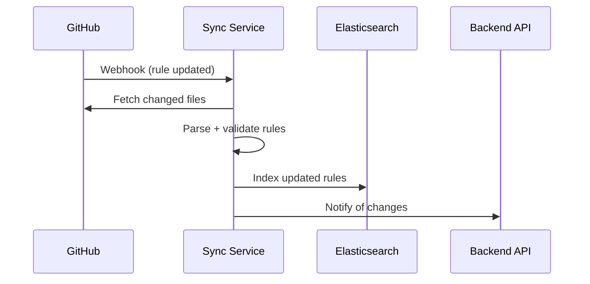
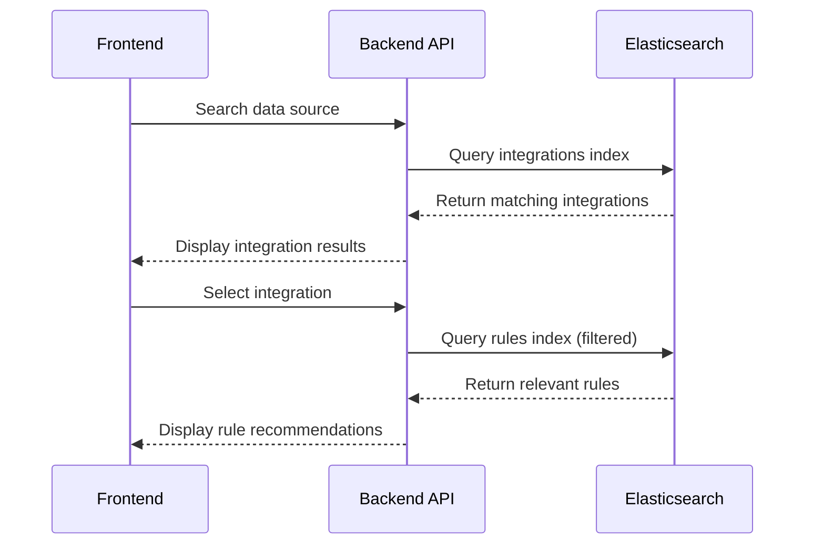

# Architecture Overview

## System Design Philosophy

The Elastic Rule Intelligence Platform follows a microservices architecture with clear separation of concerns:

### Core Principles
1. **Search-First**: Elasticsearch as the primary search and storage engine
2. **Event-Driven**: GitHub webhooks drive real-time rule synchronisation
3. **Stateless Services**: Each service can scale independently
4. **Cloud-Native**: Designed for cloud deployment with on-premises development

## Architecture Decisions

### ✅ **Decision 1: Elasticsearch for Storage + Search**
**Rationale**: 
- Eliminates dual-storage complexity (ES + PostgreSQL)
- Leverages Elasticsearch's natural document structure for rule data
- Provides built-in search capabilities without additional translation layers
- Finite dataset size makes storage costs manageable
- Read-heavy workload suits Elasticsearch perfectly

**Trade-offs**:
- Less suitable for transactional data (not needed for this use case)
- More complex querying for relational data (minimal relational needs)

### ✅ **Decision 2: Microservices with Docker**
**Architecture**:
```
┌─────────────┐  ┌─────────────┐  ┌─────────────┐
│  Frontend   │  │  Backend    │  │ Sync Service│
│  React+EUI  │  │  Node.js    │  │  Node.js    │
│  Port 3000  │  │  Port 8080  │  │  Port 8081  │
└─────────────┘  └─────────────┘  └─────────────┘
       │                 │                │
       └─────────────────┼────────────────┘
                         │
                ┌─────────────┐
                │Elasticsearch│
                │   Cloud     │
                └─────────────┘
```

**Benefits**:
- Independent scaling and deployment
- Technology flexibility per service
- Clear boundaries and responsibilities
- Easier testing and debugging

### ✅ **Decision 3: TypeScript Throughout**
**Rationale**:
- Type safety across the entire stack
- Better IDE support and developer experience  
- Easier refactoring and maintenance
- Consistent code quality

### ✅ **Decision 4: Elastic UI Framework**
**Rationale**:
- Maintains brand consistency with Elastic ecosystem
- Pre-built components accelerate development
- Accessibility built-in
- Professional appearance out-of-the-box

**Integration Approach**:
- Elastic UI provides component library
- Custom CSS/styling for unique requirements
- No conflict with additional styling frameworks

## Data Flow Architecture

### 1. Rule Synchronisation Flow


### 2. User Search Flow


### 3. Correlation Algorithm Flow
```mermaid
flowchart TD
    A[User Submits Data Source] --> B[Extract Integration Pattern]
    B --> C[Query Elasticsearch for Matching Integrations]
    C --> D{Integration Found?}
    D -->|Yes| E[Extract ECS Field Mappings]
    D -->|No| F[Return "Not Found" Message]
    E --> G[Query Rules Index with Field Filters]
    G --> H[Calculate Confidence Scores]
    H --> I[Return Ranked Rule List]
```

## Technology Stack Decisions

### Frontend Stack
```typescript
// Core Framework
React 18 + TypeScript + Elastic UI

// Key Dependencies
- @elastic/eui: ^95.0.0      // UI components
- @elastic/charts: ^60.0.0   // Data visualisation
- react-query: ^4.0.0        // Server state management
- react-router-dom: ^6.8.0   // Client-side routing
```

### Backend Stack  
```typescript
// Core Framework
Node.js + Express + TypeScript

// Key Dependencies
- @elastic/elasticsearch: ^8.11.0  // Elasticsearch client
- express: ^4.18.0                 // Web framework
- helmet: ^7.1.0                   // Security middleware
- winston: ^3.11.0                 // Logging
```

### Infrastructure Stack
```yaml
# Development
- Docker + Docker Compose
- Nginx (reverse proxy)
- Redis (caching layer)

# Production
- Elasticsearch Cloud
- Container orchestration (Docker/Kubernetes)
- GitHub Actions (CI/CD)
```

## Service Responsibilities

### 🎨 **Frontend Service** 
- User interface and experience
- Search result presentation
- Integration selection and filtering
- Rule recommendation display
- Real-time updates via WebSockets

### ⚡ **Backend API Service**
- RESTful API endpoints
- Business logic orchestration
- Authentication and authorization
- Response caching and optimization
- Integration with Elasticsearch

### 🔄 **Sync Service**
- GitHub webhook handling
- Rule file parsing and validation
- Elasticsearch index management
- Change detection and incremental updates
- Error handling and retry logic

## Data Models

### Integration Document Structure
```typescript
interface Integration {
  id: string;
  name: string;
  title: string;
  description: string;
  dataSource: string;
  categories: string[];
  ecsFields: string[];
  indexPatterns: string[];
  pipelineConfig: object;
  metadata: {
    version: string;
    lastUpdated: string;
    popularity: number;
  };
}
```

### Rule Document Structure
```typescript
interface SecurityRule {
  id: string;
  name: string;
  description: string;
  query: string;
  language: 'kuery' | 'lucene';
  requiredFields: string[];
  optionalFields: string[];
  dataSource: string[];
  riskScore: number;
  severity: 'low' | 'medium' | 'high' | 'critical';
  mitreTactics: string[];
  mitretechniques: string[];
  references: string[];
  metadata: {
    version: string;
    lastUpdated: string;
    createdBy: string;
    falsePositives: string[];
  };
}
```

## Scalability Considerations

### Horizontal Scaling
- **Frontend**: Multiple container instances behind load balancer
- **Backend**: Stateless API servers with shared cache
- **Sync Service**: Single instance with leader election for multiple replicas

### Performance Optimizations
- **Elasticsearch**: Proper index mapping and query optimization
- **Caching**: Redis for frequently accessed data
- **CDN**: Static assets and API responses
- **Pagination**: Limit result set sizes

## Security Architecture

### Data Protection
- **Environment Variables**: All secrets in environment configuration
- **API Security**: Rate limiting, CORS, security headers
- **Input Validation**: Strict validation on all user inputs
- **Access Control**: IP whitelisting and authentication (future)

### Infrastructure Security
- **Container Security**: Non-root users, minimal base images
- **Network Security**: Internal service communication only
- **Monitoring**: Comprehensive logging and alerting

## Development Workflow

### Local Development
1. **Environment Setup**: Docker Compose orchestration
2. **Hot Reloading**: File watching for all services
3. **Debugging**: Debug ports exposed for IDEs
4. **Testing**: Isolated test environments

### Production Deployment
1. **Build Process**: Multi-stage Docker builds
2. **CI/CD Pipeline**: GitHub Actions automation
3. **Health Checks**: Application and infrastructure monitoring
4. **Rollback Strategy**: Blue-green deployments

This architecture provides a solid foundation for the initial implementation while allowing for future enhancements and scaling requirements.